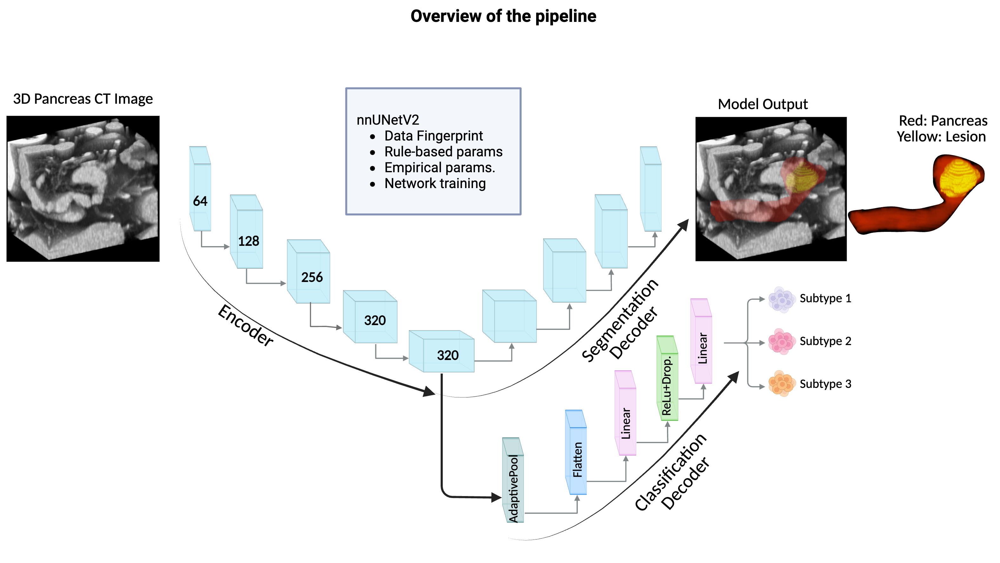

# Pancreas Multi-Task Learning with nnUNetV2

This repository is the official implementation of **A Deep Learning Pipeline for Joint Pancreas Segmentation and Subtype Classification in Abdominal CT**. It extends `nnUNetV2` by adding a **classification head** to perform **pancreas segmentation** and **subtype classification** jointly.

## Overview

  

---

## Requirements and Installation

**OS**: Ubuntu 20.04  
**nnUNet Version**: v2.6.0 (from MIC-DKFZ)

```bash
# Create conda environment and install dependencies
conda env create -f conda_env.yml
conda activate nnunetv2

# or use the requirements.txt
conda activate nnunetv2
pip install -r requirements.txt

# Clone the official nnUNet repository and install it in editable mode
git clone https://github.com/MIC-DKFZ/nnUNet.git
cd nnUNet
pip install -e .


cd nnunetv2-pancreas-multitask

# Set environment variables
mkdir ./nnUNet_raw
export nnUNet_raw="./nnUNet_raw"
mkdir ./nnUNet_preprocessed
export nnUNet_preprocessed="./nnUNet_preprocessed"
mkdir ./nnUNet_results
export nnUNet_results="./nnUNet_results"
```

---

## Dataset

The dataset used is the **Pancreas Multi-task Segmentation + Classification** dataset.

- I don't share the dataset as it was not publoc
- Save the raw data in the `./datasets` folder.
- Label CSV format (`subtype_results_train.csv`):

```csv
Name,Subtype
quiz_001.nii.gz,0
quiz_002.nii.gz,1
...
```

---

## Preprocessing

```bash
# Prepare dataset folders for nnUNetV2 format
python prepare_datasets_for_nnunetv2.py

# Convert segmentation labels (e.g., [0, 1.0003, 2] → [0, 1, 2])
python process_labels.py

# Plan and preprocess the dataset
nnUNetv2_plan_and_preprocess -d 003 --verify_dataset_integrity

# Copy the classification label CSV into the preprocessed folder
cp ./nnUNet_raw/Dataset003_PancreasMultiTask/subtype_results_train.csv ./nnUNet_preprocessed/Dataset003_PancreasMultiTask
```
---

## Training

To train the multi-task nnUNet model with a classification head:

```bash
# Copy custom trainer to nnUNet directory
cp nnUNetTrainerWithClassification.py ./nnUNet/nnunetv2/training/nnUNetTrainer/

# Train with 3D full resolution for all the folds [0,1, 2, 3, 4] for fold zero run:
CUDA_VISIBLE_DEVICES=0 nnUNetv2_train 003 3d_fullres 0 -tr nnUNetTrainerWithClassification --npz
```

To continue training:

```bash
CUDA_VISIBLE_DEVICES=0 nnUNetv2_train 003 3d_fullres 0 -tr nnUNetTrainerWithClassification --npz --c
```

---

## Inference with Improved Speed
Choose the best model among the folds (mine was #3)

```bash
python inference_fast.py \
--model_dir nnUNet_results/Dataset003_PancreasMultiTask/nnUNetTrainerWithClassification__nnUNetPlans__3d_fullres \
--input_dir nnUNet_raw/Dataset003_PancreasMultiTask/imagesVal \
--output_dir nnUNet_raw/Dataset003_PancreasMultiTask/predictionsVal \
--fold 3 \
--checkpoint checkpoint_best_combined.pth
```

---

## Evaluation

To compute segmentation metrics and classification macro-F1:

```bash
python metrics.py \
--pred_dir nnUNet_raw/Dataset003_PancreasMultiTask/predictionsVal \
--gt_dir nnUNet_raw/Dataset003_PancreasMultiTask/labelsVal \
--csv_path nnUNet_raw/Dataset003_PancreasMultiTask validation_set.csv \
--logits_path nnUNet_raw/Dataset003_PancreasMultiTask/predictionsVal/classification_logits.json \
--output_dir ./metrics_fold3_best_model_with_fast_inference
```

Evaluation includes:

- Segmentation: Dice, HD95, recall, and precision for **pancreas** (`label == 1`), for **lesions** (`label == 2`), and combined (`label == 1 or 2`)
- Classification: macro-average F1, recall, precision, and accuracy across 3 subtypes

---

## Results

| Our Multi-Task Model                        | DSC (Pancreas) | DSC (Lesion) | Macro F1 | Combined Score |
|-------------------------------|----------------|--------------|----------|----------------|
| Fold 0 | 0.91          | 0.70       | 0.92   | 0.86         |
| Fold 1 | 0.92          | 0.79       | 0.81   | 0.83         |
| Fold 2 | 0.91          | 0.78       | 0.87   | 0.86         |
| **Fold 3** | 0.90          | 0.79       | 0.90   | **0.87**         |
| Fold 4 | 0.91          | 0.73       | 0.91   | 0.86         |

## Quantitative Results of the best model (Fold3) on the validation set

| Our Multi-Task Model                        | DSC (Pancreas) | DSC (Lesion) | Macro F1 | 
|-------------------------------|----------------|--------------|----------|
| Fold 3 | 0.90          | 0.61       | 0.68   | 

## Qualitative Results of the best model (Fold3) on the validation set
  


---


## Acknowledgements

I thank the authors of [nnUNet](https://github.com/MIC-DKFZ/nnUNet) and the providers of the pancreas dataset.

---

