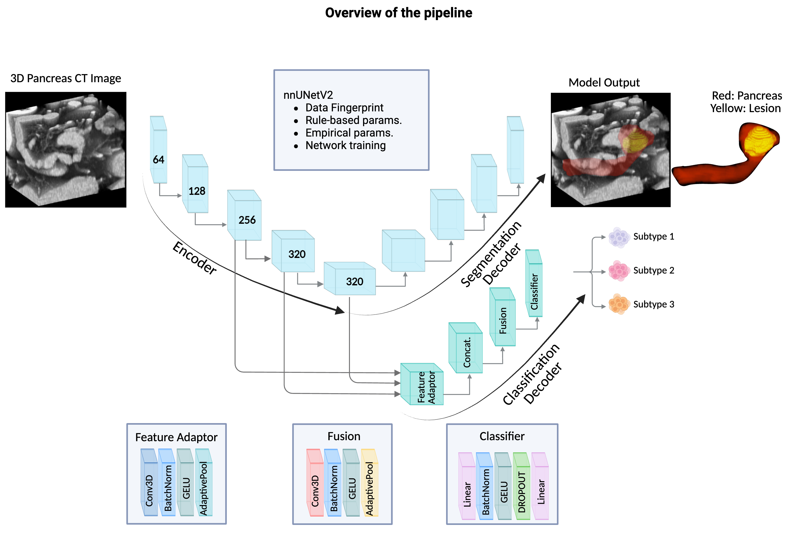

# Pancreas Multi-Task Learning with nnUNetV2

This repository is the official implementation of **A Deep Learning Pipeline for Joint Pancreas Segmentation and Subtype Classification in Abdominal CT**. It extends `nnUNetV2` by adding a **classification head** to perform **pancreas segmentation** and **subtype classification** jointly.

## 🖼 Overview

  

---

## 📦 Requirements and Installation

**OS**: Ubuntu 20.04  
**nnUNet Version**: v2.6.0 (from MIC-DKFZ)

```bash
# Create conda environment and install dependencies
conda env create -f conda_env.yml
conda activate nnunetv2

# Clone the official nnUNet repository and install it in editable mode
git clone https://github.com/MIC-DKFZ/nnUNet.git
cd nnUNet
pip install -e .

# Clone this repo and return to it
cd ../
git clone https://github.com/YOUR_USERNAME/nnunetv2-pancreas-multitask.git
cd nnunetv2-pancreas-multitask

# Set environment variables
mkdir ./nnUNet_raw
export nnUNet_raw="./nnUNet_raw"
mkdir ./nnUNet_preprocessed
export nnUNet_preprocessed="./nnUNet_preprocessed"
mkdir ./nnUNet_results
export nnUNet_results="./nnUNet_results"
```

---

## 📂 Dataset

The dataset used is the **Pancreas Multi-task Segmentation + Classification** dataset.

- Download the dataset from: [Insert link here if public]
- Save the raw data in the `./datasets` folder.
- Label CSV format (`subtype_results_train.csv`):

```csv
Name,Subtype
quiz_001.nii.gz,0
quiz_002.nii.gz,1
...
```

---

## 🧪 Preprocessing

```bash
# Prepare dataset folders for nnUNetV2 format
python prepare_datasets_for_nnunetv2.py

# Convert segmentation labels (e.g., [0, 1.0003, 2] → [0, 1, 2])
python process_labels.py

# Plan and preprocess the dataset
nnUNetv2_plan_and_preprocess -d 003 --verify_dataset_integrity

# Copy the classification label CSV into the preprocessed folder
cp ./nnUNet_raw/Dataset003_PancreasMultiTask/subtype_results_train.csv ./nnUNet_preprocessed/Dataset003_PancreasMultiTask
```
---

## 🏋️‍♀️ Training

To train the multi-task nnUNet model with a classification head:

```bash
# Copy custom trainer to nnUNet directory
cp nnUNetTrainerWithClassification.py ./nnUNet/nnunetv2/training/nnUNetTrainer/

# Train with 3D full resolution
CUDA_VISIBLE_DEVICES=0 nnUNetv2_train 003 3d_fullres 0 -tr nnUNetTrainerWithClassification --npz
```

To continue training:

```bash
CUDA_VISIBLE_DEVICES=0 nnUNetv2_train 003 3d_fullres 0 -tr nnUNetTrainerWithClassification --npz --c
```

---

## 🚀 Inference

```bash
CUDA_VISIBLE_DEVICES=0 nnUNetv2_predict -d 003 -f 0 -tr nnUNetTrainerWithClassification -c 3d_fullres -o ./nnUNet_predictions
```

---

## 🧮 Evaluation

To compute segmentation metrics and classification macro-F1:

```bash
python evaluate.py --seg_data ./nnUNet_predictions --gt_data ./nnUNet_raw/Dataset003_PancreasMultiTask/labelsTr
```

Evaluation includes:

- Dice for **whole pancreas** (`label > 0`)
- Dice for **lesions only** (`label == 2`)
- Classification **macro-average F1** across 3 subtypes

---

## 📊 Results

| Our Multi-Task Model                        | DSC (Pancreas) | DSC (Lesion) | Macro F1 | Combined Score |
|-------------------------------|----------------|--------------|----------|----------------|
| Fold 0 | 0.91          | 0.70       | 0.92   | 0.86         |
| Fold 1 | 0.92          | 0.79       | 0.81   | 0.83         |
| Fold 2 | 0.91          | 0.78       | 0.87   | 0.86         |
| Fold 3 | 0.90          | 0.79       | 0.90   | 0.87         |
| Fold 4 | 0.91          | 0.73       | 0.91   | 0.86         |


---


## 🙏 Acknowledgements

I thank the authors of [nnUNet](https://github.com/MIC-DKFZ/nnUNet) and the providers of the pancreas dataset.

---

